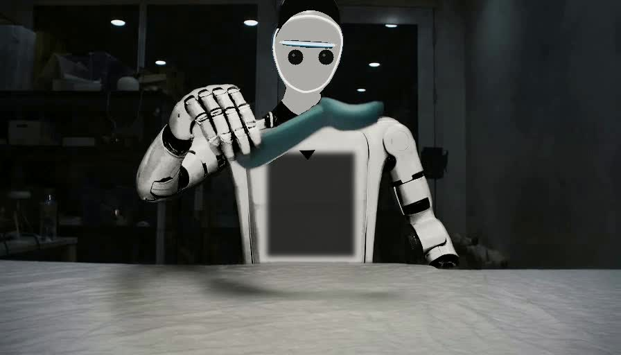

# PhiAgent-0

PhiAgent-0 is an open research system for translating human manipulation
demonstrations into embodiment-invariant physical state, robot motion, verified
simulation, and robot video:

    human video -> EPL -> robot action -> simulation -> repair -> rendering

The project is being built as measured teacher-pipeline milestones before any
attempt to train a unified foundation model.

## Demos

Click a preview to play the full MP4.

### 20.7-second five-finger Shadow hand and forearm replacement

[Play MP4](demo/showcase/five-finger-shadow-arm-background-locked.mp4)

This demo uses one uncut 20.7-second, 621-frame human-hand video from the pinned
MIT-licensed [dex-retargeting](https://github.com/dexsuite/dex-retargeting)
example. MediaPipe and Dexpilot retarget all 621 frames to the 24-DOF,
five-finger Shadow Dexterous Hand. Its segmented wrist and forearm replace the
complete visible human hand and forearm. A lossless post-encode decode audit
found zero RGB differences outside the hand-and-forearm replacement mask on
every frame. The published version applies zero-phase smoothing to the 24-DOF
trajectory and fixes the screen-space hand scale, removing the apparent
morphology/size jump during the fast fist gesture around 8-9 seconds. This is a
geometric gesture-retargeting visualization without object manipulation, not
official PhiZero inference.

### Confidence-routed three-hand comparison

[Play MP4](demo/showcase/three-hand-confidence-routed.mp4)

### Confidence-routed vendor-hand comparison

[Play MP4](demo/showcase/vendor-hand-confidence-routed-comparison.mp4)

This matched `hand2dex_3` comparison uses same-scene full-arm conditions,
replacement mode, SAM2, relighting LoRA, and object-confidence routing. It is a
`PARTIAL` proxy result: background and arm consistency improve, but strict object
and temporal gates fail and the vendor hands remain partly Sharpa-like.

### Robotiq two-finger gripper attempt

[Play MP4](demo/showcase/four-embodiment-gripper-attempt.mp4)

The existing Sharpa and Linker outputs are preserved unchanged. The fourth
column conditions the same replacement/confidence-routing pipeline on the
Apache-2.0 MuJoCo Menagerie Robotiq 2F-85 asset. It is a failed morphology
experiment: motion transfers, but Wan turns the two-finger gripper back into a
human-like hand. The video is retained as negative evidence, not a successful
gripper transfer.

### Human / silver / graphite / Sudo R1-style arm comparison

[Play MP4](demo/showcase/human-silver-graphite-sudo-vertical.mp4)

The Sudo row is a full tracked-robot appearance adaptation with a white shell,
black joints/chest cavity, and dual-camera face. It does not claim exact Sudo R1
mechanical geometry.

### Full Sudo R1-style robot

[Play MP4](demo/showcase/sudo-r1-full-robot.mp4)

This standalone view applies the Sudo-inspired appearance to the complete
SAM2-tracked robot instance—head, torso, and both arms—while preserving the
scene and manipulated object. It is an appearance proxy, not exact Sudo R1
mechanical geometry or official PhiZero inference.

## Primary goal

The primary project goal is to reproduce Figure 8(b) of PhiZero: transfer motion
from a human-hand video to a Sharpa dexterous hand. Here "hand switching" means
cross-embodiment video motion transfer, not a two-arm object handover.

The paper's Appendix C.2 protocol is:

    human-hand source video
      -> source-domain-adapted PhiZero Physical Language Tokenizer
      -> unchanged discrete physical-language sequence
    source first frame
      -> replace the human hand with a Sharpa dexterous hand
      -> edited target first frame
    tokens + edited target first frame
      -> PhiZero Wan2.2-5B diffusion decoder
      -> transferred dexterous-hand video

PhiZero's learned 25K-symbol FSQ representation is not the typed, interpretable
EPL used elsewhere in this repository. The robotics, simulation, Cosmos, and
Wan2.2-Animate paths remain auxiliary baselines and validators; they are not a
substitute for reproducing the paper's tokenizer-and-decoder path.

Prepare the three pinned public Figure 8(b) reference pairs:

    python scripts/prepare_phizero_reference.py

The official PhiZero repository currently says that code and pretrained models
are being prepared for release. Exact inference remains blocked until those
artifacts and their terms are published.

An explicitly approximate agentic proxy is available in the meantime. It
generates a Wan2.2-Animate ensemble from Sharpa first-frame candidates, evaluates
each candidate with the included local ffmpeg evaluator, and iterates failed
dimensions:

    python scripts/run_agentic_phizero_proxy.py --help

Every proxy trace is labelled `agentic_proxy_not_official_phizero`; passing its
engineering thresholds is not an exact PhiZero reproduction.

A controlled lightweight-adaptation track freezes leakage-safe data manifests for
zero-shot, appearance-LoRA, and Animate-LoRA comparisons:

    python scripts/prepare_sharpa_adaptation_manifest.py --help

The repository does not include a validated replacement-mode or identity-image-only
training entry point. See docs/SHARPA_LIGHTWEIGHT_ADAPTATION.md for the experiment and
evidence boundaries.

The reviewed DiffSynth animation-mode entry point can now be pinned and strictly
preflighted:

    python scripts/prepare_diffsynth_wan_animate.py
    python scripts/train_sharpa_animate_lora.py --help

This is not a replacement-mode trainer. Its documented configuration requires target,
pose-control, and face-control videos and eight 80 GiB GPUs.

The newer official Apache-2.0 Wan-Animate-2 proxy directly consumes a driving video
and reference image and is separately pinned:

    python scripts/prepare_wan_animate2.py
    ./scripts/bootstrap_wan_animate2_environment.sh
    python scripts/run_wan_animate2.py --help

The first pose-matched Sharpa smoke produces a clean single robot hand grasping and
moving the demonstrated object in a real scene. It remains `PARTIAL`: motion and
identity are strong, but object and temporal gates fail. It is not PhiZero execution.

## Auxiliary articulated-asset research

An optional ArtiCraft route remains available independently of the PhiZero
reproduction target:

    object description or reference image
      -> pinned mini-ArtiCraft generation
      -> isolated USDZ asset candidate and complete run record
      -> format conversion and task-specific physical validation
      -> calibrated simulation scene

Prepare the pinned upstream checkout and its isolated environment:

    python scripts/prepare_articraft.py --install

Prompt- or image-driven generation needs a configured OpenAI, Gemini, Anthropic,
or OpenRouter API because the ArtiCraft agent asks that model to write and revise
its SDK program. CAD compilation and export do not need a provider. An authored,
reviewable SDK model can be compiled entirely offline:

    PYTHONPATH=. python scripts/compile_articraft_model.py \
      external/Articraft/examples/hinged_box/main.py

Then generate a candidate asset:

    python scripts/generate_articraft_asset.py \
      "a graspable bottle with a hinged cap" \
      --experiment-root outputs/articraft

The result is not accepted as a simulation asset until conversion, collision,
contact, mass, scale, and grasp tests pass in the target simulator.

## Current result

Milestone 0 is implemented: the exact paper target, public revisions, and all
three official `hand2dex` reference pairs are pinned and machine-verifiable. The
official PhiZero implementation and checkpoints are not released, so target
inference is blocked rather than approximated.

The auxiliary robotics renderer is a pinned Cosmos3-Nano
`TrajectoryConditionedVideoRenderer`. It transforms a deterministic simulation
video associated with one accepted physical rollout and preserves its evidence.

The Cosmos adapter, CPU tests, strict checkpoint verification, deterministic
control bundle, and a four-step A800 GPU smoke are working. Its structural
alignment diagnostic passed, but pose-level and PhiZero-reference visual
acceptance are not yet claimed. The native Wan2.2-Animate pipeline has
completed its official upstream sample on an A800 and remains an unconstrained
visual teacher and diagnostic baseline. See docs/STATUS.md.

## Auxiliary Cosmos 3 pipeline

Prepare the pinned framework and checkpoint:

    python scripts/prepare_cosmos3.py --install --download-model

The default dependency group is `cu128-train`; use `--cuda-group cu130-train`
only on a CUDA 13 driver. First create a unique, physics-accepted control bundle:

    python scripts/prepare_control_video.py \
      --model inputs/scene.xml \
      --trajectory inputs/robot_trajectory.json \
      --object-body object \
      --required-contact gripper_geom,object_geom \
      --robot-base-name robot \
      --camera main \
      --experiment-root outputs/control

This resamples the same joint path at the requested video FPS, reruns physics,
and saves the aligned robot/object trajectories, simulation result,
verification record, control video, hashes, environment, and manifest.

Then run the strict Cosmos preflight before inference:

    python scripts/run_trajectory_render.py \
      --robot-trajectory inputs/robot_trajectory.json \
      --object-trajectory inputs/object_trajectory.json \
      --control-video inputs/verified_simulation.mp4 \
      --camera inputs/camera.json \
      --scene-asset inputs/scene.usd \
      --verification-record inputs/verification.json \
      --prompt "A dual-arm robot transfers an object between grippers." \
      --output outputs/cosmos3.mp4 \
      --cosmos-repo external/cosmos-framework \
      --checkpoint-dir checkpoints/Cosmos3-Nano \
      --preflight-only

The control video must be a deterministic render sampled frame-for-frame from
the same accepted trajectories. An arbitrary reference video is not valid
conditioning even if its dimensions happen to pass preflight. Successful
generation automatically runs a per-frame edge-SSIM diagnostic, but its report
remains `accepted=false` until a pose-level robot/object evaluator is available.

## Reproducible setup

On a Linux GPU host with at least 120 GiB free:

    ./scripts/audit_remote.sh phi-a800
    ./scripts/bootstrap_environment.sh
    conda activate phiagent
    python scripts/prepare_wan_animate.py

The audited GPU environment is Python 3.10, PyTorch 2.6.0, CUDA runtime 12.4,
torchvision 0.21.0, torchaudio 2.6.0, and flash-attn 2.7.4.post1. Remaining
Wan dependencies are pinned in requirements/wan-animate.txt.

Run a preflight before inference:

    python scripts/run_visual_transfer.py \
      --video demo/human.mp4 \
      --robot-image demo/robot.png \
      --prompt "A robot picks up the demonstrated object." \
      --output outputs/robot.mp4 \
      --wan-repo external/Wan2.2 \
      --checkpoint-dir checkpoints/Wan2.2-Animate-14B \
      --preflight-only

Launch the real, long-running job in tmux:

    ./scripts/launch_tmux.sh phiagent-m1 \
      python scripts/run_visual_transfer.py \
      --video demo/human.mp4 \
      --robot-image demo/robot.png \
      --prompt "A robot picks up the demonstrated object." \
      --output outputs/robot.mp4 \
      --wan-repo external/Wan2.2 \
      --checkpoint-dir checkpoints/Wan2.2-Animate-14B

Do not pass a GPU index unless one must be reserved explicitly. The runner
selects the freest GPU with at least 60 GiB available and refuses to start if
none qualifies. An explicit --gpu value is validated against the same threshold.

## Wan diagnostic baseline

Wan2.2-Animate is a visual motion-transfer baseline, not the PhiZero tokenizer
or its Wan2.2-5B physical-language-conditioned decoder. Its native animate
implementation accepts a prompt argument but does not use that prompt in the
animation generator. PhiAgent records the prompt for provenance and reports
this limitation rather than pretending it conditioned the result. Basic pose
retargeting is the default; optional FLUX retargeting is available with
--use-flux after its separate license is reviewed.

## Development

The lightweight package has no CUDA dependency:

    python -m venv .venv
    .venv/bin/python -m pip install -e ".[dev]"
    .venv/bin/python -m pytest
    .venv/bin/ruff check .

Architecture, experiment rules, blockers, and PhiZero reproduction milestones
live under docs/.
