# PhiAgent-0

> **Play every video directly on the
> [web demo](https://yuhuajiang2002.github.io/PhiAgent/).**

> **Watch
> [three PhiAgent T-shirt-folding strategies](https://yuhuajiang2002.github.io/PhiAgent/#tshirt-fold-strategies)
> side by side.**

PhiAgent-0 is an open research system for translating human manipulation
demonstrations into embodiment-invariant physical state, robot motion, verified
simulation, and robot video:

    human video -> EPL -> robot action -> simulation -> repair -> rendering

The project is being built as measured teacher-pipeline milestones before any
attempt to train a unified foundation model.

## Multi-strategy T-shirt folding

Three user-approved 8-second, 1024x768, 24 FPS generated videos now form a
hash-bound positive-reference bank for alternating, staged, and synchronized
two-arm folding choreography. The synchronized 1920x720 comparison is available
on the [web demo](https://yuhuajiang2002.github.io/PhiAgent/#tshirt-fold-strategies)
or as a [direct MP4](demo/showcase/tshirt-fold-strategies/three-strategy-comparison.mp4).
The harness may use each original video as a camera-pixel proposal prior only;
it cannot relax cloth-identity, contact, continuity, task-order, background, or
native-resolution review gates. These videos show distinct visual robot-folding
strategies, not calibrated cloth physics or real-robot execution. See the
[generation lessons and evidence boundary](docs/TSHIRT_MULTI_STRATEGY_REFERENCES.md).

## Key concepts

- **EPL (Embodied Physical Language)** is PhiAgent's typed, interpretable
  intermediate representation for manipulation. An EPL sequence divides a
  demonstration into time intervals and records the manipulation phase,
  frame-explicit end-effector motion, wrist pose, five fingertip positions, hand
  aperture/articulation, contact state, object pose and motion, scene relations,
  and confidence. Coordinates carry named frames (for example, `camera`,
  `world`, or `robot_base`) rather than being mixed implicitly. EPL is structured
  physical state and motion—not natural-language instructions, robot joint
  commands, or rendered video. The current v0.1 schema is defined in
  [`phiagent/physical_language/schema.py`](phiagent/physical_language/schema.py).
- **Robot action / retargeting** converts embodiment-independent EPL motion into
  a particular robot's joint trajectory while respecting that robot's kinematics
  and joint limits. Different embodiments may therefore execute the same EPL
  with different joint commands.
- **Simulation and verification** replay a retargeted trajectory in a physics
  simulator and measure requirements such as contact, collision, joint limits,
  and task success. A plausible-looking video alone is not proof of a valid
  physical rollout.
- **Repair** uses verifier failures to propose bounded trajectory changes, then
  simulates and checks the result again. A repair is accepted only when the
  relevant verification gates pass.
- **Rendering** turns an accepted motion or control bundle into viewable video.
  Some published visual-transfer demos instead use video-generation and
  compositing baselines; these are appearance or motion-transfer results, not
  automatically physics-verified robot executions.
- **Teacher pipeline** refers to the modular perception -> EPL -> retargeting ->
  simulation -> repair path used to generate measurable supervision and
  diagnostics before training a unified model.
- **PhiZero physical-language tokens are not EPL.** PhiZero describes a learned,
  discrete 25K-symbol FSQ representation. EPL is PhiAgent's separately designed,
  human-readable typed schema and cannot be substituted for those unreleased
  tokens when claiming an exact PhiZero reproduction.

## Demos

Click a preview below to open its MP4.

### URDF-constrained RM65 simulation replay

[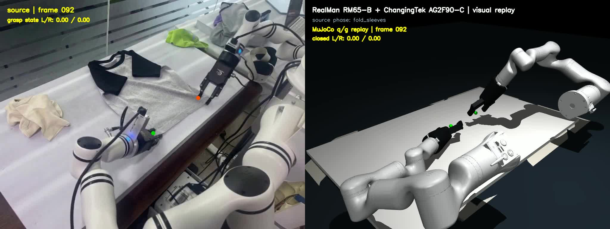](https://yuhuajiang2002.github.io/PhiAgent/#rm65-simulation-replay)

[Play the synchronized source-versus-simulation MP4](https://yuhuajiang2002.github.io/PhiAgent/showcase/rm65-ag2f90c-source-vs-simulation-v16.mp4),
[watch the simulation alone](https://yuhuajiang2002.github.io/PhiAgent/showcase/rm65-ag2f90c-simulation-only-v16.mp4),
or inspect the [measured audit](demo/showcase/rm65-ag2f90c-source-vs-simulation-v16-audit.json)
and [method description](docs/RM65_SIMULATION_REPLAY_DEMO.md).

This demo shows that the source-conditioned folding motion can be realized in
MuJoCo as a URDF-constrained joint replay for two six-axis RealMan RM65-B arms
with AG2F90-C grippers. The eight-second output contains 192 synchronized frames
at 24 FPS. Visible wrist-to-tip constraints and branch-continuous multistart IK
remove the position-equivalent wrist-flip solution; a fixed left tool-roll
offset keeps both gripper planes parallel to the tabletop. Every state is finite
and IK-solvable in the published model; mean left/right EEF
forward-kinematics residual is 0.72/0.68 mm, with maxima of 3.78/1.92 mm. This is
a working kinematic simulation result. It does not by
itself claim cloth dynamics, collision-safe control, calibrated camera
extrinsics, or recorded real-robot execution.

### Supplemental real-scene action-conditioned comparison

[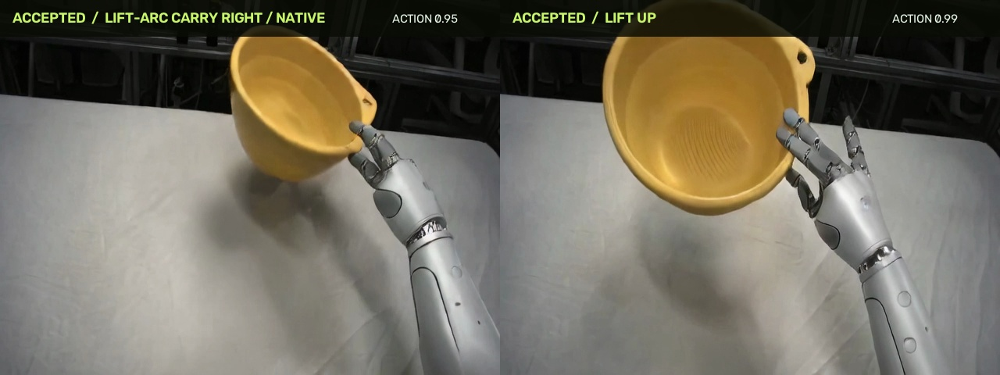](https://yuhuajiang2002.github.io/PhiAgent/showcase/oscar-acwm-accepted-comparison.mp4)

[Play the matched bowl-grasp comparison](https://yuhuajiang2002.github.io/PhiAgent/showcase/oscar-acwm-accepted-comparison.mp4).
The same real Hand2Dex-2 first frame, seed, and OSCAR-2B settings produce two
distinct 81-frame futures: lift then carry right (left) and lift up (right).
This is a camera-skeleton-conditioned video result, not physical robot execution.

### JoyAI late flower-contact prompt and Best-of-4 noise

[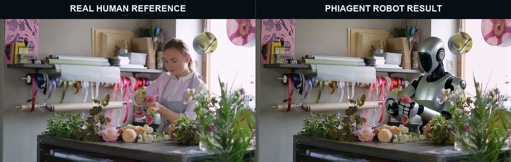](https://yuhuajiang2002.github.io/PhiAgent/#joyai-late-contact)

[Play the 27.5-second comparison](https://yuhuajiang2002.github.io/PhiAgent/showcase/joyai-late-flower-contact-seed17-v1.mp4)
or read the [reproduction protocol](docs/JOYAI_LATE_FLOWER_CONTACT.md).
The source is on the left and the selected direct JoyAI-Video-Edit 0811 result
is on the right. A frozen persistent-contact prompt and full-timeline seeds 17,
42, 73, and 101 improve late projected contact from 5/11 to 9/11. Seed 17 wins
the declared independent temporal-jitter tie-break, but its authoritative
lossless audit still passes only 145/147 persistent-grasp frames. The result is
therefore `PARTIAL`; remaining failed frames are disclosed and no 3-D contact,
force closure, or real-robot execution is claimed. SAM masks were used for
offline measurement only, not to composite the published robot pixels.

### Does the current web demo use EPL?

**No—not as an input or conditioning signal for the currently published
showcase videos.** The Shadow-hand clip uses MediaPipe plus Dexpilot geometric
retargeting directly, and the remaining comparison videos are visual
transfer/compositing proxies. They do not execute the complete
`human video -> EPL -> robot action -> simulation` path, so they must not be
presented as EPL-conditioned robot execution.

EPL is implemented and exercised elsewhere in the repository: the synthetic
human-to-simulation integration path writes `epl.json`, EPL drives
multi-embodiment retargeting, and the matched repair-policy experiment compares
EPL-conditioned and EPL-masked policies. These are currently research and
validation results rather than the videos on the public demo page; see
[`docs/EXPERIMENTS.md`](docs/EXPERIMENTS.md) for the measured evidence.

### Egocentric (ego) video examples and replacement feasibility

Here **ego video** means first-person video captured by a head-, chest-, or
wrist-mounted camera.

#### Confidence-routed cabbage-cutting: human vs. robot

[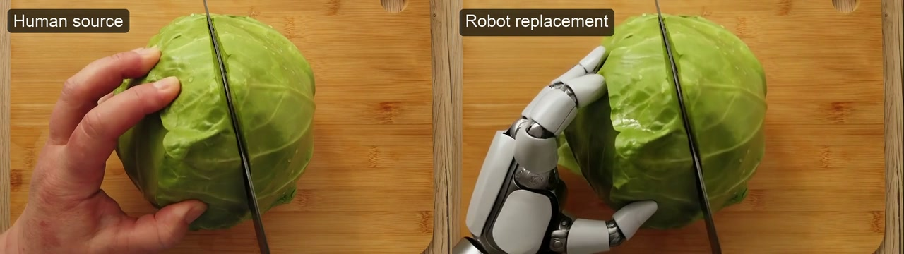](https://yuhuajiang2002.github.io/PhiAgent/showcase/ego-cabbage-human-vs-robot-confidence-routed.mp4)

[Play MP4](https://yuhuajiang2002.github.io/PhiAgent/showcase/ego-cabbage-human-vs-robot-confidence-routed.mp4)

This three-second, 90-frame side-by-side example places the human source on the
left and the robot replacement on the right. It uses Wan2.2-Animate replacement
mode, compiled SAM2, the released relighting LoRA, seed 42, and the
same raw-candidate confidence-routing principle as the three-hand comparison.
The delivered video disables framewise robot overlays, destructive object
overwrite, deghosting, and temporal filtering. Dense review of 30 uniformly
sampled frames found no visible long trails, duplicate hands, or human skin.
It remains `PARTIAL`: the deterministic proxy rejects object consistency
(`0.662`) and regional temporal consistency (`0.146`), and no robot kinematics,
contact physics, or real execution is established.

Useful follow-up test cases, ordered from easiest to hardest, are:

1. **Tabletop pick-and-place:** one visible hand approaches, grasps, moves, and
   releases one rigid object. A 3-5 second clip with little head motion is the
   recommended first smoke test.
2. **Drawer or cabinet opening:** the hand grasps a handle and produces an
   articulated object motion. This tests whether replacement preserves contact
   and the handle rather than only copying free-space hand motion.
3. **Spoon stirring or tool manipulation:** the tool must remain visible,
   attached to the correct grasp, and temporally stable under repeated motion.
4. **Pouring:** the hand, container, receiving vessel, and changing object state
   introduce severe occlusion; preserving liquid behavior is outside the current
   replacement model's verified capabilities.
5. **Bimanual assembly or packaging:** two hands cross and occlude each other,
   making identity, handedness, masks, and contact substantially harder.

Potential research sources include
[Ego4D](https://ego4d-data.org/) for diverse head-mounted daily activities,
[EPIC-KITCHENS VISOR](https://epic-kitchens.github.io/VISOR/) for hand/object
segmentations in kitchen activities, and
[Ego-Exo4D](https://ego-exo4d-data.org/) for synchronized first- and
third-person skilled activities. Dataset access and redistribution terms must be
checked before adding any clip to this repository. A short, consented
self-recording is preferable for the first reproducible test.

**Can PhiAgent replace the human hand in ego video?** The current answer is
`PARTIAL`: the published cabbage-cutting clip demonstrates a visually coherent
replacement without the previous framewise-overlay trails, but it does not pass
the repository's strict object and regional-temporal gates. Ego video still adds
head-camera motion, motion blur, hands entering at the image boundary, large
perspective changes, self-occlusion, and frequent hand-object overlap. A target
robot image must also match the first-person viewpoint, handedness, wrist entry,
scale, and initial grasp; a front-facing product image is not a valid condition.

The first experiment should use one authorized 77-89-frame, one-hand
pick-and-place clip and compare:

- **Source:** unchanged ego video.
- **Visual baseline:** replacement-mode robot-hand video, with the source
  background and manipulated object protected outside the hand/forearm mask.
- **Geometric baseline:** MediaPipe landmarks retargeted to a dexterous hand,
  composited into the source view.

Acceptance requires reviewing the entire clip and measuring hand identity,
motion, object retention, temporal consistency, outside-mask pixel changes, and
contact at grasp/release—not only inspecting selected frames. Until a run passes
those gates, ego replacement remains `PARTIAL` visual evidence rather than a
validated physical capability.

Visual ego replacement does not require EPL. A physically grounded ego pipeline
does: moving-camera pose and depth must first place wrist, fingertips, contacts,
and object motion into a stable `world` or `robot_base` frame before EPL
retargeting. The EPL schema can represent these named frames, but real-ego camera
tracking, metric reconstruction, and end-to-end simulation validation are not
yet implemented as an accepted result.

### 20.7-second five-finger Shadow hand and forearm replacement

[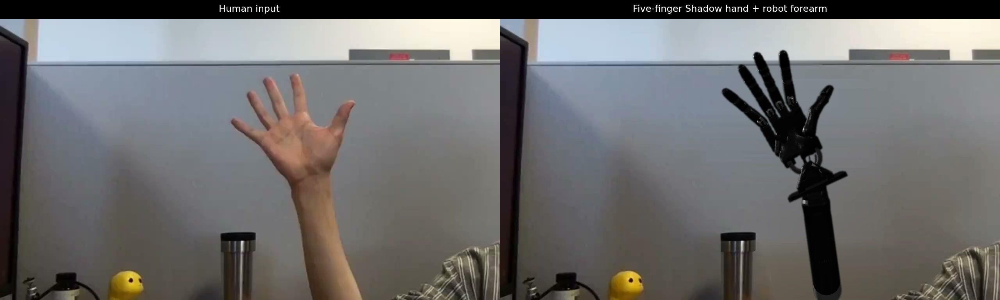](https://yuhuajiang2002.github.io/PhiAgent/showcase/five-finger-shadow-arm-background-locked.mp4)

[Play MP4](https://yuhuajiang2002.github.io/PhiAgent/showcase/five-finger-shadow-arm-background-locked.mp4)

This demo uses one uncut 20.7-second, 621-frame human-hand video from the pinned
MIT-licensed [dex-retargeting](https://github.com/dexsuite/dex-retargeting)
example. MediaPipe and Dexpilot retarget all 621 frames to the 24-DOF,
five-finger Shadow Dexterous Hand. Its segmented wrist and forearm replace the
complete visible human hand and forearm. A lossless post-encode decode audit
found zero RGB differences outside the hand-and-forearm replacement mask on
every frame. The published version applies zero-phase smoothing to the 24-DOF
trajectory and fixes the screen-space hand scale, removing the apparent
morphology/size jump during the fast fist gesture around 8-9 seconds. This is a
geometric gesture-retargeting visualization without object manipulation, not
official PhiZero inference.

#### H3MR 21-Keypoint Overlay Comparison

[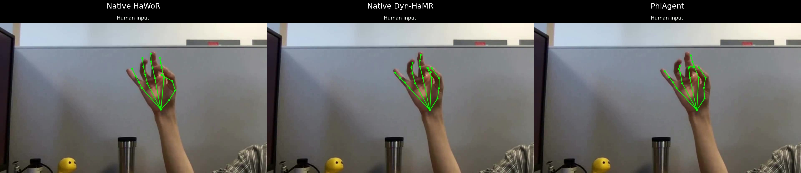](https://yuhuajiang2002.github.io/PhiAgent/showcase/h3mr-21-keypoint-overlay-comparison.mp4)

[Play MP4](https://yuhuajiang2002.github.io/PhiAgent/showcase/h3mr-21-keypoint-overlay-comparison.mp4)

#### H3MR MANO Mesh Comparison

[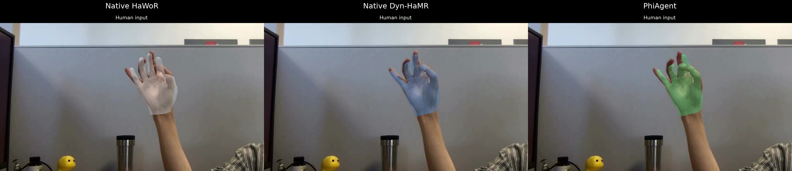](https://yuhuajiang2002.github.io/PhiAgent/showcase/h3mr-mano-mesh-comparison.mp4)

[Play MP4](https://yuhuajiang2002.github.io/PhiAgent/showcase/h3mr-mano-mesh-comparison.mp4)

### Confidence-routed three-hand comparison

[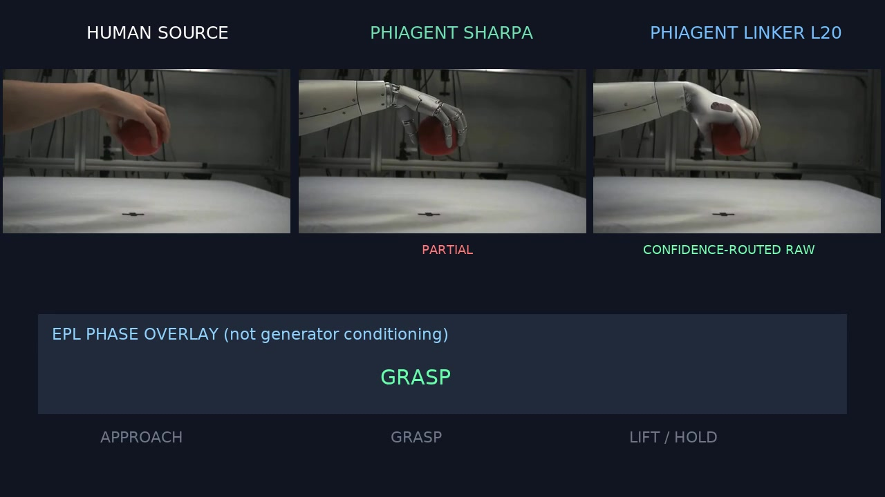](https://yuhuajiang2002.github.io/PhiAgent/showcase/three-hand-confidence-routed.mp4)

[Play MP4](https://yuhuajiang2002.github.io/PhiAgent/showcase/three-hand-confidence-routed.mp4)

### Confidence-routed vendor-hand comparison

[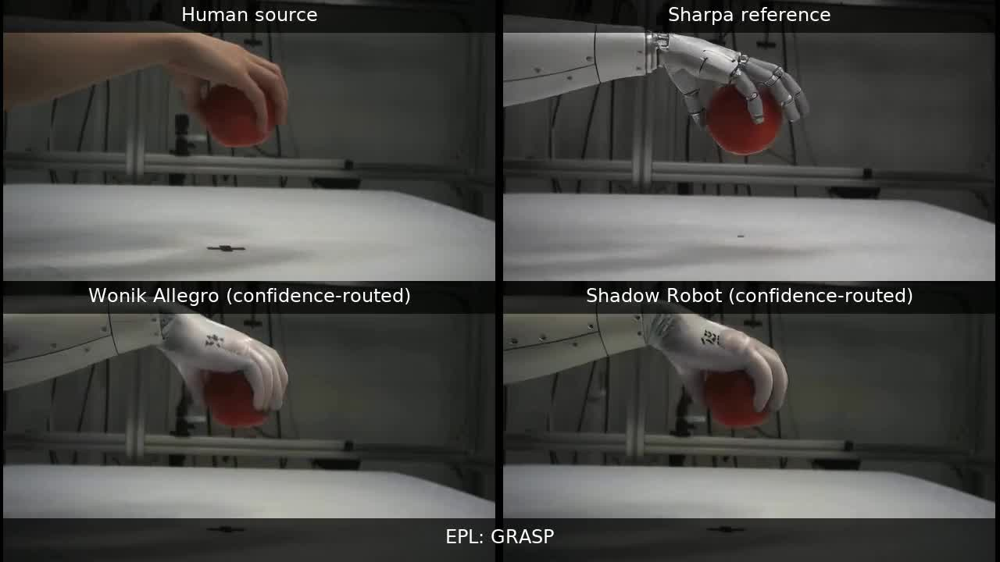](https://yuhuajiang2002.github.io/PhiAgent/showcase/vendor-hand-confidence-routed-comparison.mp4)

[Play MP4](https://yuhuajiang2002.github.io/PhiAgent/showcase/vendor-hand-confidence-routed-comparison.mp4)

This matched `hand2dex_3` comparison uses same-scene full-arm conditions,
replacement mode, SAM2, relighting LoRA, and object-confidence routing. It is a
`PARTIAL` proxy result: background and arm consistency improve, but strict object
and temporal gates fail and the vendor hands remain partly Sharpa-like.

### Robotiq two-finger gripper attempt

[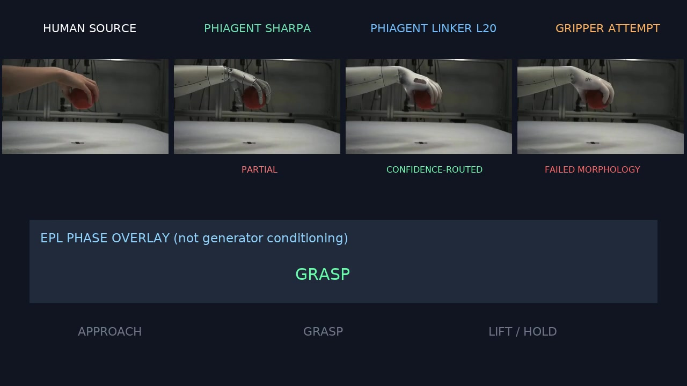](https://yuhuajiang2002.github.io/PhiAgent/showcase/four-embodiment-gripper-attempt.mp4)

[Play MP4](https://yuhuajiang2002.github.io/PhiAgent/showcase/four-embodiment-gripper-attempt.mp4)

The existing Sharpa and Linker outputs are preserved unchanged. The fourth
column conditions the same replacement/confidence-routing pipeline on the
Apache-2.0 MuJoCo Menagerie Robotiq 2F-85 asset. It is a failed morphology
experiment: motion transfers, but Wan turns the two-finger gripper back into a
human-like hand. The video is retained as negative evidence, not a successful
gripper transfer.

### Human / silver / graphite / Sudo R1-style arm comparison

[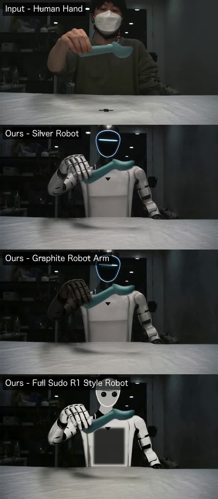](https://yuhuajiang2002.github.io/PhiAgent/showcase/human-silver-graphite-sudo-vertical.mp4)

[Play MP4](https://yuhuajiang2002.github.io/PhiAgent/showcase/human-silver-graphite-sudo-vertical.mp4)

The Sudo row is a full tracked-robot appearance adaptation with a white shell,
black joints/chest cavity, and dual-camera face. It does not claim exact Sudo R1
mechanical geometry.

## Primary goal

The primary project goal is to reproduce Figure 8(b) of PhiZero: transfer motion
from a human-hand video to a Sharpa dexterous hand. Here "hand switching" means
cross-embodiment video motion transfer, not a two-arm object handover.

The paper's Appendix C.2 protocol is:

    human-hand source video
      -> source-domain-adapted PhiZero Physical Language Tokenizer
      -> unchanged discrete physical-language sequence
    source first frame
      -> replace the human hand with a Sharpa dexterous hand
      -> edited target first frame
    tokens + edited target first frame
      -> PhiZero Wan2.2-5B diffusion decoder
      -> transferred dexterous-hand video

PhiZero's learned 25K-symbol FSQ representation is not the typed, interpretable
EPL used elsewhere in this repository. The robotics, simulation, Cosmos, and
Wan2.2-Animate paths remain auxiliary baselines and validators; they are not a
substitute for reproducing the paper's tokenizer-and-decoder path.

Prepare the three pinned public Figure 8(b) reference pairs:

    python scripts/prepare_phizero_reference.py

The official PhiZero repository currently says that code and pretrained models
are being prepared for release. Exact inference remains blocked until those
artifacts and their terms are published.

An explicitly approximate agentic proxy is available in the meantime. It
generates a Wan2.2-Animate ensemble from Sharpa first-frame candidates, evaluates
each candidate with the included local ffmpeg evaluator, and iterates failed
dimensions:

    python scripts/run_agentic_phizero_proxy.py --help

Every proxy trace is labelled `agentic_proxy_not_official_phizero`; passing its
engineering thresholds is not an exact PhiZero reproduction.

A controlled lightweight-adaptation track freezes leakage-safe data manifests for
zero-shot, appearance-LoRA, and Animate-LoRA comparisons:

    python scripts/prepare_sharpa_adaptation_manifest.py --help

The repository does not include a validated replacement-mode or identity-image-only
training entry point. See docs/SHARPA_LIGHTWEIGHT_ADAPTATION.md for the experiment and
evidence boundaries.

The reviewed DiffSynth animation-mode entry point can now be pinned and strictly
preflighted:

    python scripts/prepare_diffsynth_wan_animate.py
    python scripts/train_sharpa_animate_lora.py --help

This is not a replacement-mode trainer. Its documented configuration requires target,
pose-control, and face-control videos and eight 80 GiB GPUs.

The newer official Apache-2.0 Wan-Animate-2 proxy directly consumes a driving video
and reference image and is separately pinned:

    python scripts/prepare_wan_animate2.py
    ./scripts/bootstrap_wan_animate2_environment.sh
    python scripts/run_wan_animate2.py --help

The first pose-matched Sharpa smoke produces a clean single robot hand grasping and
moving the demonstrated object in a real scene. It remains `PARTIAL`: motion and
identity are strong, but object and temporal gates fail. It is not PhiZero execution.

## Auxiliary articulated-asset research

An optional ArtiCraft route remains available independently of the PhiZero
reproduction target:

    object description or reference image
      -> pinned mini-ArtiCraft generation
      -> isolated USDZ asset candidate and complete run record
      -> format conversion and task-specific physical validation
      -> calibrated simulation scene

Prepare the pinned upstream checkout and its isolated environment:

    python scripts/prepare_articraft.py --install

Prompt- or image-driven generation needs a configured OpenAI, Gemini, Anthropic,
or OpenRouter API because the ArtiCraft agent asks that model to write and revise
its SDK program. CAD compilation and export do not need a provider. An authored,
reviewable SDK model can be compiled entirely offline:

    PYTHONPATH=. python scripts/compile_articraft_model.py \
      external/Articraft/examples/hinged_box/main.py

Then generate a candidate asset:

    python scripts/generate_articraft_asset.py \
      "a graspable bottle with a hinged cap" \
      --experiment-root outputs/articraft

The result is not accepted as a simulation asset until conversion, collision,
contact, mass, scale, and grasp tests pass in the target simulator.

## Current result

Milestone 0 is implemented: the exact paper target, public revisions, and all
three official `hand2dex` reference pairs are pinned and machine-verifiable. The
official PhiZero implementation and checkpoints are not released, so target
inference is blocked rather than approximated.

The auxiliary robotics renderer is a pinned Cosmos3-Nano
`TrajectoryConditionedVideoRenderer`. It transforms a deterministic simulation
video associated with one accepted physical rollout and preserves its evidence.

The Cosmos adapter, CPU tests, strict checkpoint verification, deterministic
control bundle, and a four-step A800 GPU smoke are working. Its structural
alignment diagnostic passed, but pose-level and PhiZero-reference visual
acceptance are not yet claimed. The native Wan2.2-Animate pipeline has
completed its official upstream sample on an A800 and remains an unconstrained
visual teacher and diagnostic baseline. See docs/STATUS.md.

## Auxiliary Cosmos 3 pipeline

Prepare the pinned framework and checkpoint:

    python scripts/prepare_cosmos3.py --install --download-model

The default dependency group is `cu128-train`; use `--cuda-group cu130-train`
only on a CUDA 13 driver. First create a unique, physics-accepted control bundle:

    python scripts/prepare_control_video.py \
      --model inputs/scene.xml \
      --trajectory inputs/robot_trajectory.json \
      --object-body object \
      --required-contact gripper_geom,object_geom \
      --robot-base-name robot \
      --camera main \
      --experiment-root outputs/control

This resamples the same joint path at the requested video FPS, reruns physics,
and saves the aligned robot/object trajectories, simulation result,
verification record, control video, hashes, environment, and manifest.

Then run the strict Cosmos preflight before inference:

    python scripts/run_trajectory_render.py \
      --robot-trajectory inputs/robot_trajectory.json \
      --object-trajectory inputs/object_trajectory.json \
      --control-video inputs/verified_simulation.mp4 \
      --camera inputs/camera.json \
      --scene-asset inputs/scene.usd \
      --verification-record inputs/verification.json \
      --prompt "A dual-arm robot transfers an object between grippers." \
      --output outputs/cosmos3.mp4 \
      --cosmos-repo external/cosmos-framework \
      --checkpoint-dir checkpoints/Cosmos3-Nano \
      --preflight-only

The control video must be a deterministic render sampled frame-for-frame from
the same accepted trajectories. An arbitrary reference video is not valid
conditioning even if its dimensions happen to pass preflight. Successful
generation automatically runs a per-frame edge-SSIM diagnostic, but its report
remains `accepted=false` until a pose-level robot/object evaluator is available.

## Reproducible setup

On a Linux GPU host with at least 120 GiB free:

    ./scripts/audit_remote.sh phi-a800
    ./scripts/bootstrap_environment.sh
    conda activate phiagent
    python scripts/prepare_wan_animate.py

The audited GPU environment is Python 3.10, PyTorch 2.6.0, CUDA runtime 12.4,
torchvision 0.21.0, torchaudio 2.6.0, and flash-attn 2.7.4.post1. Remaining
Wan dependencies are pinned in requirements/wan-animate.txt.

Run a preflight before inference:

    python scripts/run_visual_transfer.py \
      --video demo/human.mp4 \
      --robot-image demo/robot.png \
      --prompt "A robot picks up the demonstrated object." \
      --output outputs/robot.mp4 \
      --wan-repo external/Wan2.2 \
      --checkpoint-dir checkpoints/Wan2.2-Animate-14B \
      --preflight-only

Launch the real, long-running job in tmux:

    ./scripts/launch_tmux.sh phiagent-m1 \
      python scripts/run_visual_transfer.py \
      --video demo/human.mp4 \
      --robot-image demo/robot.png \
      --prompt "A robot picks up the demonstrated object." \
      --output outputs/robot.mp4 \
      --wan-repo external/Wan2.2 \
      --checkpoint-dir checkpoints/Wan2.2-Animate-14B

Do not pass a GPU index unless one must be reserved explicitly. The runner
selects the freest GPU with at least 60 GiB available and refuses to start if
none qualifies. An explicit --gpu value is validated against the same threshold.

## Wan diagnostic baseline

Wan2.2-Animate is a visual motion-transfer baseline, not the PhiZero tokenizer
or its Wan2.2-5B physical-language-conditioned decoder. Its native animate
implementation accepts a prompt argument but does not use that prompt in the
animation generator. PhiAgent records the prompt for provenance and reports
this limitation rather than pretending it conditioned the result. Basic pose
retargeting is the default; optional FLUX retargeting is available with
--use-flux after its separate license is reviewed.

## Development

The lightweight package has no CUDA dependency:

    python -m venv .venv
    .venv/bin/python -m pip install -e ".[dev]"
    .venv/bin/python -m pytest
    .venv/bin/ruff check .

Architecture, experiment rules, blockers, and PhiZero reproduction milestones
live under docs/.
