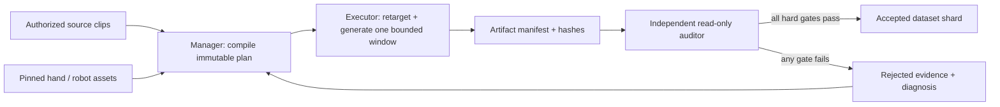

# PhiAgent Embodied Data Engine

PhiAgent's Data Engine is a reproducible control plane for turning authorized
human-manipulation video into many cross-embodiment video candidates. It makes
the source, target hand or robot, retargeter, generator, auditor, seed, and
temporal window independently replaceable while keeping every decision tied to
immutable evidence.

The control plane is `WORKING` on CPU. The large-scale generation executors and
a completed 100-hour accepted dataset are `PARTIAL` / `NOT STARTED`; this
document does not claim otherwise.

## Design lineage

Two public harness designs informed the repository structure:

- [DeepSeek Harness](https://github.com/deepseek-ai/deepseek-harness) treats the
  system surface as plugins. PhiAgent applies that idea to source ingestion,
  retargeting, generation, and audit through a lightweight entry-point ABI.
- [LongHorizon-Harness](https://github.com/AMAP-ML/LongHorizon-Harness) separates
  long work into a Manage-Execute-Audit loop. PhiAgent persists explicit job
  state, gives execution a bounded job/window, and permits acceptance only from
  an independent, evidence-bound auditor.

The proposal model or generator is never the acceptance authority. A high mean
score cannot override a failed hard gate, and the executor cannot audit its own
output.

## Control flow



`source × target × candidate_seed` expands into deterministic jobs, and each
job expands into overlapping rolling windows. The plan SHA-256 is stable for an
unchanged campaign. Every new planning run receives a new directory containing
the copied campaign, immutable plan, initial state, command, seed, Git state,
hostname, Python and package versions, and an append-only event log.

State transitions are deliberately narrow:

```text
pending -> running -> audit_pending -> accepted
                             \------> rejected -> running
```

Only an independent audit can reach `accepted`. Failed gates and evidence stay
in audit history instead of disappearing behind an aggregate score.

## Plugin contract

The standard-library-only package lives in `phiagent/data_engine`. Heavy model
code is loaded only through explicit adapters in the
`phiagent.data_engine.plugins` entry-point group; importing `phiagent` does not
load CUDA, PyTorch, a simulator, or checkpoints.

Built-in descriptors currently cover:

| Stage | Adapters | Scope |
| --- | --- | --- |
| Source | `local-video-source` | hash-bound video and lineage |
| Retarget | `dex-retarget`, `epl-retarget` | hand or full embodiment, named robot-base frame |
| Generate | `wan-animate2`, `oscar` | visual hand/full-embodiment candidates |
| Audit | `local-video-auditor`, `physical-auditor` | read-only visual or physical gates |

These descriptors define and validate capabilities; they are not a claim that
every production executor is implemented. In particular, the current pilot
asset files are lock descriptors. Shadow, Allegro, and Unitree execution still
requires resolving and pinning the exact production asset bytes and revisions.

List the current contract surface:

```bash
PYTHONPATH=. python -m phiagent.data_engine.cli plugins
```

## Campaigns and gates

The pilot campaign is
[`configs/data_engine/pilot-100h.json`](../configs/data_engine/pilot-100h.json).
It contains one evaluation clip, three hand targets, one full-body target, and
two candidate seeds, compiling to eight deterministic jobs. It is a small plan
fixture, not the source corpus for 100 hours. Its source rights note explicitly
requires training authorization before production use.

Visual-training-data acceptance requires every one of these hard gates:

1. source lineage;
2. exact asset identity;
3. complete human removal;
4. motion preservation;
5. object preservation;
6. temporal continuity;
7. background preservation.

A physically grounded claim additionally requires metric camera state, a
complete exact robot trajectory, persistent object geometry, and contact force.
Image-space similarity cannot substitute for those four gates.

Compile a campaign into a fresh run directory:

```bash
PYTHONPATH=. python -m phiagent.data_engine.cli plan \
  configs/data_engine/pilot-100h.json \
  --output-root outputs/data-engine
```

Workers then use the file-locked manager instead of editing state by hand:

```bash
PYTHONPATH=. python -m phiagent.data_engine.cli status "$DATA_RUN"
PYTHONPATH=. python -m phiagent.data_engine.cli claim "$DATA_RUN" \
  --worker a800-worker-07
PYTHONPATH=. python -m phiagent.data_engine.cli submit "$DATA_RUN" \
  --job-id job-... --worker a800-worker-07 \
  --artifact-manifest-uri s3://bucket/run/artifact-manifest.json \
  --artifact-manifest-sha256 0123456789abcdef0123456789abcdef0123456789abcdef0123456789abcdef
PYTHONPATH=. python -m phiagent.data_engine.cli requeue "$DATA_RUN" \
  --job-id job-... --reason "worker heartbeat expired"
PYTHONPATH=. python -m phiagent.data_engine.cli audit "$DATA_RUN" audit-report.json
```

`claim`, `submit`, and `audit` are serialized with a POSIX file lock, increment
the persisted state revision, and append transition events. The immutable plan
hash is revalidated whenever state is loaded. A submit is rejected unless its
artifact-manifest SHA-256 is well formed; an audit report still needs separate
hash-bound evidence for every acceptance decision. The manager intentionally
does not embed a model runtime—workers execute the pinned adapters listed in the
leased job. A stranded running or audit-pending job can be explicitly requeued
with its reason retained, then reclaimed as a new attempt.

## 100 accepted hours: capacity projection

The conservative Data Engine projection uses the measured persistent
rolling-window Wan infrastructure profile in
[`configs/data_engine/benchmarks.json`](../configs/data_engine/benchmarks.json):
27.5 output seconds took 822.755 wall seconds on two A800s, or 29.918 wall
seconds and 59.837 A800-seconds per output second. The evidence is bound to
benchmark SHA-256
`778ee914ef68d1c22e1f329e49d1af4b5b69bf459d3c669a83a0aa1959b3e8fd`.

The base production assumptions are 100 **accepted** hours, 80% first-pass
yield, 85% accelerator utilization, 15% non-generation overhead, two A800s per
worker, ten-second average clips, four reviewers, 1.25 reviewer-hours per
accepted video hour, 8 Mbps delivery, and a 4x working-storage multiplier.

| A800 count | Workers | Calendar time | Accepted video/day | Total A800-hours |
| ---: | ---: | ---: | ---: | ---: |
| 2 | 1 | 210.8 days | 0.47 h | 8,602 |
| 8 | 4 | 52.7 days | 1.90 h | 8,602 |
| 32 | 16 | **13.2 days** | **7.59 h** | 8,602 |
| 64 | 32 | **6.6 days** | 15.18 h | 8,602 |

At 32 A800s, yield sensitivity is 17.6 days at 60%, 13.2 days at 80%, and
11.7 days at 90%. The base case generates 125 raw hours / 45,000 ten-second
candidates to retain 100 hours / 36,000 clips. Generation is the modeled
bottleneck; 125 reviewer-hours take 31.25 hours with four reviewers. Estimated
delivery storage is 360 GB and working storage is 1.44 TB.

Reproduce any scenario:

```bash
PYTHONPATH=. python -m phiagent.data_engine.cli estimate \
  configs/data_engine/benchmarks.json \
  --profile wan-a800-persistent-rolling-v6 \
  --target-hours 100 --accelerators 32 --yield 0.8
```

This is a measured-infrastructure projection, not a completed 100-hour run. It
does not yet include a confidence interval from repeated A800 trials, observed
production acceptance yield, retry-tail behavior, multi-host scaling loss, or
the cost of resolving source-data rights. The earlier JoyAI estimate in
`docs/JOYAI_SCISSORS_CONTACT.md` models a different, much faster service path
and source-hour throughput; it must not be presented as equivalent to this
accepted-output Wan projection.

## Path from pilot to a credible public data engine

1. Resolve exact target asset revisions and an authorized, diverse source
   corpus; lock every byte and split by scene before generation.
2. Implement executor adapters behind the plugin ABI, including mandatory GPU
   preflight, physical-device selection, `CUDA_VISIBLE_DEVICES`, and run-local
   selection evidence.
3. Run a one-hour multi-target pilot; measure acceptance yield, retry tails,
   utilization, storage, and inter-rater agreement instead of assuming them.
4. Promote only if visual gates pass independently across at least two scene or
   task groups. Keep morphology failures as first-class benchmark cases.
5. Publish a small reproducible benchmark, manifests, negative evidence, cost
   card, and plugin authoring guide before scaling to 100 hours.
6. For physical-data claims, add metric camera, exact URDF/MJCF trajectory,
   persistent geometry, simulator/sensor contact, and adversarial contact
   audits. Until then, label outputs visual training data.

The interactive dashboard in [`demo/index.html`](../demo/index.html) exposes
GPU-count and first-pass-yield controls and reads the same exported scenario
data used above. Its displayed boundary is part of the demo, not a footnote.
