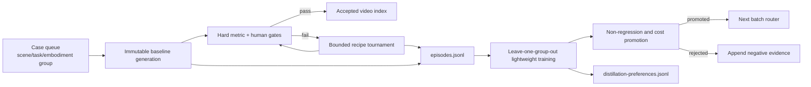

# Agentic demo-video data flywheel

Evidence date: 2026-08-11. Overall status: **PARTIAL**.

The environment-level factory harness is implemented and CPU-tested. No new
foundation-model, LoRA, or planner checkpoint has yet been trained on a real
multi-scene factory campaign, and no GPU batch is accepted by this document.

## Objective and boundary

The factory turns reviewed agentic video-generation attempts into two reusable
artifacts:

1. a small standard-library ridge router that predicts which bounded generation
   or repair recipe should be tried next; and
2. grouped chosen/rejected preference rows that can later supervise a planner
   adapter without exposing the frozen evaluation groups.

The first artifact solidifies the capability in the harness. The second is the
bridge toward solidifying routing behavior in model weights. Accepted generated
videos may also become video-model training data, but only after rights,
deduplication, leakage, task, and quality audits separate training from frozen
evaluation scenes.



## Contracts

The reference quality contract is
`configs/demo_factory/agentic_video_demo_contract_v1.json`. Create a separate
contract and checkpoint for every task domain. In particular, do not apply a
flower policy to an Ego bottle case or mix camera-pixel controls with
robot-base actions.

Each campaign declares:

- one baseline recipe and a deterministic fallback recipe order;
- metric weights for utility reporting and independent hard thresholds that no
  aggregate score may override;
- per-capability non-regression tolerances measured against the same episode's
  baseline;
- a cost budget and cost penalty;
- whether an explicit human review is required;
- cases with stable `episode_id`, held-out `group_id`, domain, seed, and an
  immutable case manifest;
- CPU or physical-GPU execution and a bounded number of attempts.

Every recipe command is an adapter. It may invoke the existing AC-WM, H3, Wan,
compositing, or evaluator scripts, but it must accept the campaign placeholders
and print a final one-line JSON object:

```json
{
  "video": "/absolute/attempt/directory/candidate.mp4",
  "metrics": {
    "action_adherence": 0.82,
    "embodiment_consistency": 0.88,
    "object_interaction": 0.80,
    "temporal_consistency": 0.84,
    "background_consistency": 0.91
  },
  "human_review_passed": true,
  "cost_units": 1.0,
  "diagnoses": []
}
```

The candidate must be created inside `{attempt_dir}`. Available placeholders
are `{case_manifest}`, `{recipe_manifest}`, `{attempt_dir}`, and `{seed}`.
Commands execute without a shell. A GPU campaign inventories physical devices,
selects or validates one, records it, sets `CUDA_VISIBLE_DEVICES`, and takes the
repository GPU lease before launching a worker.

## Native AC-WM adapter and multi-scene campaign

`scripts/run_acwm_demo_factory_worker.py` adapts one bounded native
`run_agentic_acwm.py` round to the worker protocol. It accepts only factory-owned
case and recipe snapshots, requires the outer runner's physical-GPU selection,
keeps the native trace and candidate under the immutable attempt directory, and
records source, revision, coordinate-frame, trace, video, and manifest hashes.

Each case manifest uses schema `1.0.0` and must explicitly provide:

```json
{
  "schema_version": "1.0.0",
  "episode_id": "scene-a-slide-right",
  "group_id": "scene-a",
  "case_id": "slide-right",
  "domain": "agentic-robot-demo-video",
  "seed": 20260811,
  "license_id": "the-reviewed-source-license",
  "source_uri": "file:///immutable/source-a.mp4",
  "source_sha256": "64-lowercase-hex-characters",
  "condition_manifest_sha256": "64-lowercase-hex-characters",
  "action_coordinate_frame": "camera:oscar_640x480_pixels",
  "generator": {"id": "oscar", "revision": "pinned-revision-or-checkpoint-hash"},
  "evaluator": {"id": "evaluate-acwm-candidate", "revision": "git-or-contract-hash"},
  "runner_command": [
    "python",
    "scripts/run_agentic_acwm.py",
    "--condition-manifest",
    "/immutable/condition-manifest.json",
    "--human-review-dir",
    "/immutable/human-reviews",
    "--backend",
    "oscar"
  ]
}
```

Include pinned backend/checkpoint arguments in `runner_command`. Do not include
worker-owned `--case`, `--prompt-suffix`, `--experiment-root`,
`--maximum-rounds`, `--seed`, or `--gpu`; the adapter supplies them. The source
license and hash are declarations that must be audited before accepting the
result as training data.

Build a complete four-recipe bootstrap campaign only after at least two
independent case manifests exist:

```bash
python scripts/build_acwm_demo_factory_campaign.py \
  --campaign-id acwm-two-scene-bootstrap-v1 \
  --case-manifest /cases/scene-a.json \
  --case-manifest /cases/scene-b.json \
  --physical-gpu-index 4 \
  --output /campaigns/acwm-two-scene-bootstrap-v1.json

python scripts/run_demo_factory_batch.py \
  --campaign /campaigns/acwm-two-scene-bootstrap-v1.json \
  --validate-only
```

The builder refuses one-scene or same-source inputs, requires a real human
review directory, verifies condition-manifest hashes, binds generator and
evaluator revisions, and emits raw, identity-safe, object-safe, and
temporal-safe recipes. Bootstrap mode always measures all four recipes.

## Bootstrap: collect complete tournaments

Start with at least two truly separate scene, subject, object, or embodiment
groups. Set these execution fields in the campaign:

```json
{
  "device": "gpu",
  "physical_gpu_index": 4,
  "minimum_free_gpu_mib": 60000,
  "maximum_attempts_per_episode": 4,
  "collect_all_recipes": true
}
```

`collect_all_recipes` is the exploration mode. It measures every recipe even if
an earlier candidate passes, which is required for unbiased held-group replay.
Use a new experiment root for every run:

```bash
python scripts/run_demo_factory_batch.py \
  --campaign /path/to/bootstrap-campaign.json \
  --experiment-root outputs/demo-video-factory
```

The run saves configuration, command lines, Git state, hostname, Python, GPU
inventory and selection, worker logs, video hashes, per-attempt assessments,
`episodes.jsonl`, and `accepted-video-index.json`.

## Train and promote the router

Train from one or more immutable batch datasets:

```bash
python scripts/train_demo_factory_router.py \
  --dataset /run-a/episodes.jsonl \
  --dataset /run-b/episodes.jsonl \
  --contract configs/demo_factory/agentic_video_demo_contract_v1.json \
  --minimum-acceptance-rate 0.70 \
  --experiment-root outputs/demo-factory-router
```

Training is CPU-only and uses no NumPy or model runtime. Every recipe must have
measurements in every group. Each group is held out once. A checkpoint is
promoted only when held-group replay satisfies all of the following:

- the absolute acceptance-rate floor;
- no acceptance regression versus the declared fallback order;
- no selected capability regression;
- no utility regression beyond the explicit tolerance;
- no increase in mean attempts;
- no cost regression beyond the explicit tolerance.

Rejected checkpoints and their evidence remain in their unique run directory.
The trainer also exports `distillation-preferences.jsonl`. Treat this as planner
supervision, not as evidence that model weights have already improved.

## Production and continuous evolution

Use only a promoted checkpoint for exploitation batches:

```bash
python scripts/run_demo_factory_batch.py \
  --campaign /path/to/production-campaign.json \
  --policy /promoted/run/policy.json \
  --experiment-root outputs/demo-video-factory
```

Keep `collect_all_recipes` false in ordinary production so the router stops at
the first guarded success. Reserve a fixed exploration fraction of new groups
for complete tournaments; merge those new immutable datasets into the next
training run. Never train on a frozen acceptance group, silently lower a hard
gate, or promote a checkpoint solely because average proxy utility rises.

For model-internal distillation, train a small planner LoRA/SFT or preference
adapter on the exported chosen/rejected recipe decisions, then replay it through
the same held-group and cost gates before replacing the ridge router. For
generator LoRA training, use only accepted, licensed, deduplicated videos and
retain separate real-input acceptance data. The harness remains the authority
for evidence even after a learned planner is introduced.

## Measured real-history replay

The existing EPIC Ego bottle repair history was migrated without rescoring or
inventing human approvals into the unified record contract:

- import: `outputs/demo-factory-history-import/20260811T151158Z-4f2960eb`;
- 30 hashed, already-generated real-input candidates;
- six episodes, three action groups, and five measured repair recipes per
  episode;
- router: `outputs/demo-factory-router-real-history/20260811T151204Z-256a5d8e`.

Leave-one-action-group-out replay produced 0.0 acceptance for both learned and
fallback routes, 5.0 mean attempts, 5.0 mean cost units, and 1.0 selected
non-regression. Every non-regression/cost gate passed, but the absolute minimum
acceptance gate failed, so the checkpoint was correctly not promoted. These
records remain valuable negative and ranking evidence. They do not establish a
display-ready factory because explicit human acceptance was absent or other
hard gates failed, and the three action groups share one source interval rather
than two independent scenes.

## Current acceptance evidence and next real gate

The focused CPU suite covers record validation, hidden capability regression,
baseline-bound contexts, group leakage rejection, held-group promotion,
checkpoint round-trip, command-worker execution, immutable video hashing, and
accepted-index creation. This establishes the software loop, not production
quality or throughput.

The next claim-eligible run must use at least two licensed real scene groups and
every declared recipe, execute through the native AC-WM adapter, complete
explicit human review, train one router, and then measure a fresh held-scene
production batch. Record both the bootstrap and production conclusions in
`experiences/ledger.jsonl`.
