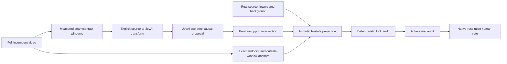

# JoyAI flower-task challenger

## Scope

JoyAI-Video-Edit is an optional proposal model for measured long-video failure
windows. It is not a physical observer and is not allowed to establish metric
depth, robot telemetry, contact force, force closure, or real-robot safety.
Importing `phiagent` does not import Torch, CUDA, JoyAI, or its checkpoints.

The pinned integration uses:

- source repository revision `231aab0d32f62fefc853cf9a046b8f29b4a39dfd`;
- `jdopensource/JoyAI-Video-Edit` revision
  `7c36b253d34449e8cd96241fcd9236a7fe9b30bc`;
- `XiaomiMiMo/MiMo-VL-7B-RL-2508` revision
  `4bfb270765825d2fa059011deb4c96fdd579be6f`;
- the released two-step source-fidelity model in BF16; FP8 is disabled on the
  experimental A800 path.

## First-principles boundary

For a source frame, factor visible state into immutable environment `E`,
immutable manipulated-flower state `F`, and editable robot state `R`. JoyAI may
propose `R'` only inside the intersection of a measured temporal window, the
source-person spatial support, and the model crop. The compositor then applies
the projection

`P(E, F, R') = source(E) + source(F) + bounded(R')`.

This makes preservation a construction property instead of a prompt-following
hope. The first and last frame of every repair window receive zero generative
weight, all frames outside the windows are exact incumbent frames, and flowers
and background are restored from the source after blending.

The current measured seam windows are `[463, 495]` and `[543, 575]`. Each has
33 frames, satisfying JoyAI's causal layout `1 + 4 * 8`: one global first-chunk
sink followed by four 8-frame causal chunks with recent KV state.

## Pipeline



## Commands

Prepare the exact 1280x720 incumbent without rescaling:

```bash
python scripts/prepare_joyai_flower_windows.py \
  --candidate-video /path/to/incumbent-lossless.mkv \
  --output-dir outputs/joyai-flower-edit/<new-run> \
  --ffmpeg /path/to/ffmpeg --ffprobe /path/to/ffprobe
```

The low-resolution historical candidate may be tested only with the explicit
`--allow-isotropic-fit-height-upscale` flag. Its manifest records the resize
and crop; it is not metric evidence and should not replace a native-resolution
candidate.

Download pinned snapshots. The providers are independently selectable so a
slow or rate-limited Hub can be replaced without changing the pinned release
contract. For example, keep a resumable Hugging Face JoyAI download while using
the pinned ModelScope mirror for MiMo:

```bash
python scripts/download_joyai_video_edit_weights.py \
  --checkpoint-root checkpoints/joyai \
  --output-dir outputs/joyai-runtime/<new-download-run> \
  --model-provider huggingface \
  --text-encoder-provider modelscope
```

Install the official optional runtime and the SM80/BF16-only `joyomni_ops`
extension without making it an import-time dependency of `phiagent`:

```bash
python scripts/setup_joyai_video_edit_runtime.py \
  --repository external/JoyAI-Video-Edit \
  --python .venv-joyai/bin/python \
  --output-dir outputs/joyai-runtime/<new-runtime-run>
```

The default A800/BF16 setup keeps every inference dependency but omits the six
CUTLASS/CUDA-Python packages used only to compile JoyAI's disabled FP8 GEMM.
Both the upstream and effective requirement hashes and the exact removed lines
are saved. Pass `--include-fp8-build-deps` only for a future FP8-capable build.

Launch the experimental two-A800 placement:

```bash
python scripts/launch_joyai_video_edit_server.py \
  --repository external/JoyAI-Video-Edit \
  --checkpoint-root checkpoints/joyai \
  --output-dir outputs/joyai-runtime/<new-server-run> \
  --python .venv-joyai/bin/python \
  --physical-gpu 1 --physical-gpu 2
```

Generate one 33-frame proposal through the official WebSocket protocol:

```bash
.venv-joyai/bin/python scripts/run_joyai_video_edit_client.py \
  --input-video /path/to/window.mkv \
  --output-dir outputs/joyai-flower-edit/<new-proposal-run> \
  --expected-frames 33
```

Compose only reviewed proposals:

```bash
python scripts/compose_joyai_flower_repairs.py \
  --source-video /path/to/source.mp4 \
  --incumbent-video /path/to/incumbent-lossless.mkv \
  --person-masks /path/to/person-masks-packed.npz \
  --flower-masks /path/to/flower-masks-packed.npz \
  --window 463 495 /path/to/proposal-00.mkv \
  --window 543 575 /path/to/proposal-01.mkv \
  --output-dir outputs/joyai-flower-edit/<new-composition-run>
```

The default composition contract is source-native `1280x720`. It reverses the
JoyAI input crop by inserting the proposal at source coordinates
`x=[16,1264), y=[0,720)` without scaling. Existing `832x480` packed masks are
explicitly padded into their historical `854x480` source-aligned canvas and
nearest-neighbor projected to `1280x720`; this transform is written to the
manifest. Use `--mask-projection source_native` only for masks whose stored
dimensions already equal the source video.

## Promotion contract

JoyAI remains `proposal_only`. A result stays `PARTIAL` until all deterministic
locks, non-frozen flower response, transition continuity, adversarial attacks,
full-resolution hand topology/drag review, long-term identity, and a human veto
pass. Scores cannot compensate for one failed hard gate. Physical promotion
remains false without two independent physical evidence groups.

The official deployment was tested on one B200. The two-A800 split in this
repository is an experimental adapter and must record an actual successful
preflight and generation speed before it can be described as working.
