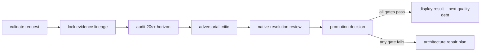

# PhiAgent workflow framework

PhiAgent now exposes its research pipelines as explicit state graphs instead of
requiring users to manually chain path-coupled scripts. The runtime is inspired
by LangGraph's useful execution model—named nodes, conditional edges,
thread-scoped checkpoints, streaming, interrupts, and replay—but it is a small
PhiAgent API rather than a LangGraph compatibility layer.

The core package has no third-party dependencies. Importing
`phiagent.workflows` does not import Torch, CUDA, a simulator, or model weights.
Heavy generation and evaluation programs remain optional CLIs behind
`SubprocessNode` adapters.

## Quick start

List and inspect recipes:

```bash
phiagent-workflow list
phiagent-workflow describe flower-long-video --format mermaid
```

Run the checked-in 27.5-second flower-video audit as a new, immutable
experiment:

```bash
phiagent-workflow run flower-long-video \
  --config configs/workflows/flower-long-video-27p5s-v1.json \
  --output-dir outputs/workflows/$(date -u +%Y%m%dT%H%M%SZ)-flower-27p5s \
  --thread-id flower-27p5s-v1
```

Every run refuses to overwrite an existing directory and records its resolved
configuration, command, Git state, host, Python/package versions, event log,
append-only checkpoints, node artifacts, and final result.

## Developer API

```python
from phiagent.workflows import END, JsonFileCheckpointer, StateGraph


def measure(state):
    return {"score": state["signal"] * 2}


def decide(state):
    return "pass" if state["score"] >= 0.8 else "fail"


graph = StateGraph()
graph.add_node("measure", measure)
graph.add_node("accept", lambda state: {"status": "accepted"})
graph.add_node("reject", lambda state: {"status": "rejected"})
graph.set_entry_point("measure")
graph.add_conditional_edges(
    "measure",
    decide,
    {"pass": "accept", "fail": "reject"},
)
graph.add_edge("accept", END)
graph.add_edge("reject", END)

app = graph.compile(
    name="example",
    checkpointer=JsonFileCheckpointer("outputs/example/checkpoints"),
)
result = app.invoke({"signal": 0.5}, config={"thread_id": "sample-1"})
```

Nodes accept either `(state)` or `(state, context)` and return a JSON mapping,
`Command(update=..., goto=...)`, or `None`. State updates overwrite their keys
unless the graph declares a reducer. Inputs are top-level read-only mappings,
and every checkpoint validates finite JSON and stores a canonical state hash.

### Interrupt and resume

An approval node can pause without losing state:

```python
def native_review(state, context):
    verdict = context.interrupt({"video": state["candidate_video"]})
    return {"review": verdict}
```

Resume it with `Command(resume=value)` or the CLI `resume` command. The node
runs again from its beginning; therefore side effects before an interrupt must
be idempotent. Failed nodes persist an `ERROR` checkpoint and can be rerun with
`Command(retry=True)` or `phiagent-workflow retry`.

### Existing scripts as nodes

`SubprocessNode` runs an argv list directly, never through a shell. It records
the command, stdout, stderr, elapsed time, return code, declared outputs, and
environment overrides under the node artifact directory.

```python
from phiagent.workflows import CommandSpec, SubprocessNode


def build_command(state, context):
    return CommandSpec(
        argv=("python", "scripts/run_wan_animate2.py", "--config", state["config"]),
        cwd=state["workspace_root"],
        expected_outputs=(state["candidate_path"],),
        physical_gpu_index=state["physical_gpu_index"],
    )


graph.add_node("generate", SubprocessNode(build_command, result_key="generation"))
```

When `physical_gpu_index` is declared, the adapter calls `nvidia-smi`, validates
that physical card, sets `CUDA_VISIBLE_DEVICES`, and saves the complete
selection. Individual GPU scripts must still keep their own preflight and
experiment manifest so a direct invocation remains safe.

## Flower-arranging reference graph

The first migrated recipe is intentionally narrow and fail-closed:



The graph treats long-video quality as a state-factorization problem:

- Flowers, native background, and measured flower response motion are immutable
  source-state layers. A video model cannot rewrite them to improve a score.
- One persistent full-timeline embodiment state anchors robot identity. Reach,
  grasp, transport, insertion, and release are phase-local views of that state,
  not unrelated clips.
- Official video foundation models propose only bounded robot-layer candidates.
  Shared-anchor latent bridges target measured route-transition outliers without
  cross-dissolving hands or flowers.
- Post-decode locks, all-frame late-horizon metrics, sealed adversarial attacks,
  and native-resolution review retain promotion authority. A mean score never
  overrides one failed hard gate.
- Model depth, projected 2-D contact, Qwen criticism, and generated telemetry
  remain proposal or diagnostic channels. They do not establish metric 3-D
  contact, force closure, exact `q/qdot`, or executable robot motion.

The checked-in policy cannot be weakened below 20 seconds, 0.99 background
exactness, 1.0 flower exactness, 0.95 flower dynamic-frame coverage, or 0.95
late projected-contact recall. The last is a hard *visible-interaction* gate but
remains explicitly non-physical. Failures choose a representation or validation
change; the planner explicitly forbids threshold tuning as a repair.

## Current boundary

This migration provides the runtime and a complete flower-video reference
workflow. Existing AC-WM, retargeting, simulation, and renderer CLIs have not
all been converted into built-in recipes yet; they can be wrapped incrementally
with the same node ABI. The 27.5-second flower result is eligible only for the
synthetic visual-display scope. Physical-contact promotion remains false.
